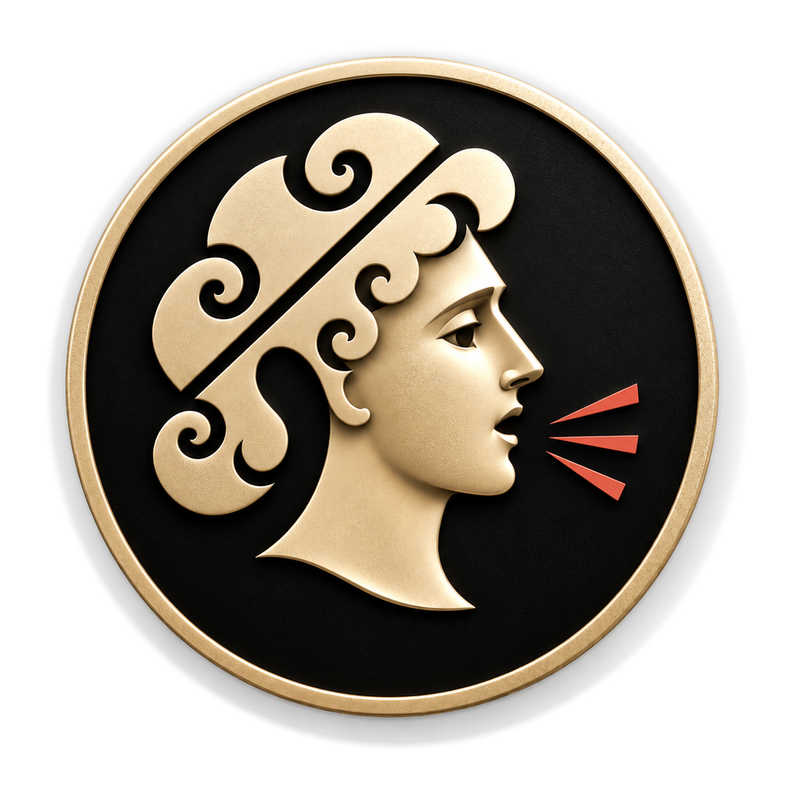
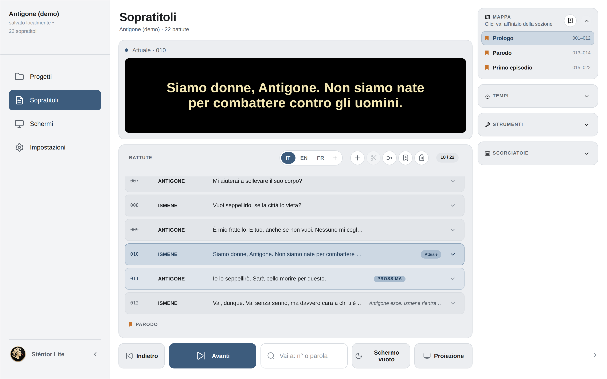
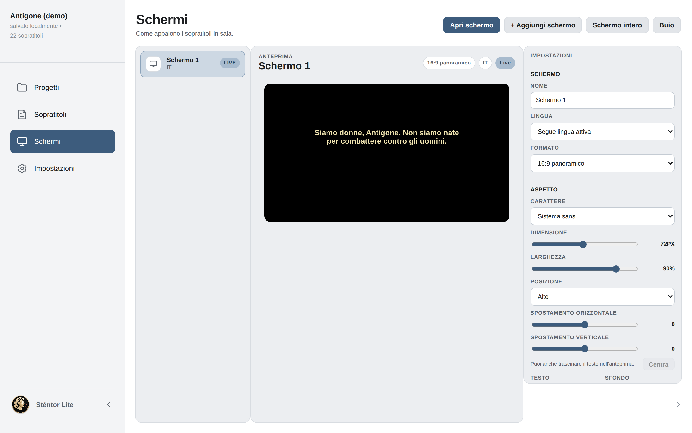
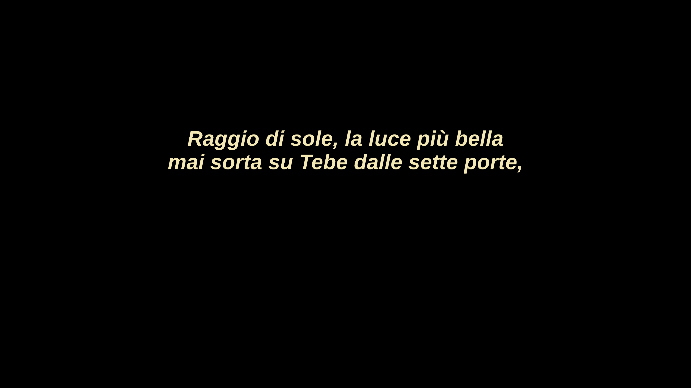

<p align="center">
  
</p>

<h1 align="center">Sténtor Lite</h1>

<p align="center">
  Sopratitoli per il teatro dal vivo: prepara il testo, traducilo, proiettalo in sala.<br>
  <em>Surtitles for live theatre: prepare the text, translate it, project it in the hall.</em>
</p>

<p align="center">
  <a href="#italiano">Italiano</a> · <a href="#english">English</a> · <a href="CHANGELOG.md">Novità · Changelog</a>
</p>

<p align="center">
  
</p>

---

## Italiano

Sténtor Lite è un programma gratuito e open source per gestire i sopratitoli di spettacoli dal vivo: prosa, opera, danza, conferenze. Funziona su macOS e Windows come app desktop, oppure nel browser.

**Versione 0.8, beta.** È già usabile in sala, ma può contenere errori: prima di uno spettacolo provalo con il tuo proiettore e salva sempre una copia del progetto (vedi [I tuoi progetti](#i-tuoi-progetti)).

### Cosa fa

- **Progetti**: archivio degli spettacoli, con copertina, compagnia e autore; apertura e salvataggio di file di progetto. Al primo avvio si apre una demo con alcune scene dall'*Antigone* di Sofocle.
- **Importazione**: copioni Word (`.docx`), con riconoscimento di personaggi, battute, didascalie e marcatori; tabelle Excel o CSV (una colonna per lingua, più personaggio e note); presentazioni PowerPoint (una diapositiva per battuta); sottotitoli SRT e VTT, con i tempi; testo semplice; progetti di Sténtor Pro (`.stn`).
- **Scrittura**: elenco delle battute modificabile direttamente, divisione e unione, personaggi, note di regia, stili (grassetto, corsivo, colore, dimensione) su singole parole.
- **Lingue**: più traduzioni nello stesso progetto; ogni schermo può mostrare una lingua diversa. Con il tasto destro su una lingua la rendi principale o la elimini.
- **Conduzione dal vivo**: Avanti, Indietro, Vai a (per numero, marcatore o testo), Buio; mappa dello spettacolo per atti e scene.
- **Schermi**: uno o più schermi di proiezione, ciascuno con carattere, dimensione, colori, formato e posizione del testo, regolabile a piacere anche trascinandolo nell'anteprima; finestra di proiezione da spostare sul proiettore, con gli stessi tasti della regia.
- **Tempo**: cronometro della recita con durata di atti e scene; registrazione e riproduzione facoltative dei tempi delle battute.
- **Strumenti**: verifica del testo (righe troppo lunghe, testi mancanti, spazi) e pulizia automatica.
- **Scorciatoie da tastiera** personalizzabili.
- **Interfaccia in 25 lingue**: italiano, inglese, francese, tedesco, spagnolo, portoghese, svedese, danese, norvegese, finlandese, polacco, ceco, slovacco, croato, serbo, bulgaro, russo, ucraino, greco, turco, cinese semplificato e tradizionale, arabo, hindi, malayalam (vedi [Traduzioni](#traduzioni)).

<p align="center">
  
</p>

### Scaricare l'app

Le versioni per Mac (Apple Silicon e Intel) e Windows sono nella pagina [**Releases**](../../releases) di questo repository.

Le app non sono ancora firmate da Apple e Microsoft, quindi al primo avvio compare un avviso di sicurezza:

- **Mac**: apri il file `.dmg` e trascina Sténtor Lite in Applicazioni. Al primo avvio macOS lo blocca: vai in **Impostazioni di Sistema → Privacy e sicurezza**, scorri in fondo e scegli **Apri comunque**, poi conferma. Serve solo la prima volta.
- **Windows**: se compare «Windows ha protetto il PC», scegli **Ulteriori informazioni → Esegui comunque**.

### I tuoi progetti

Sténtor Lite salva da solo i progetti **dentro l'app** (nel browser, se lo usi lì). Se disinstalli l'app, cancelli i dati del browser o cambi computer, quei progetti non ci sono più.
Per avere una copia sicura usa **Salva** o **Salva con nome…** nella pagina Progetti: ottieni un file `.stentore.json` che puoi conservare, mandare ai colleghi e riaprire con **Importa**. Prima di ogni spettacolo salva una copia aggiornata.

<p align="center">
  
</p>

### Avviarlo dal codice sorgente

Serve [Node.js](https://nodejs.org/) 22 o successivo.

```bash
npm ci
npm run dev
```

Poi apri l'indirizzo mostrato nel Terminale (di solito `http://localhost:5173/stentore-browser/`).

Per l'app desktop servono anche [Rust](https://www.rust-lang.org/tools/install) e i [prerequisiti di Tauri](https://v2.tauri.app/start/prerequisites/) per il tuo sistema:

```bash
npm run desktop:dev     # app desktop in sviluppo
npm run desktop:build   # pacchetto installabile per il tuo sistema
npm test                # test automatici
```

### Struttura

| Cartella | Contenuto |
| --- | --- |
| `src/` | interfaccia (React + Vite): `components/`, `hooks/`, `utils/`, `styles/` |
| `src/i18n/` | testi dell'interfaccia per chiave, un file per lingua o per area |
| `src/lib/demoProject.js` | il progetto dimostrativo (Antigone) |
| `public/public-stage.html` | finestra dello schermo di proiezione |
| `src-tauri/` | app desktop (Tauri 2, Rust) |
| `tests/` | test (`node --test`) |
| `docs/translations/` | glossari e tabelle di revisione delle traduzioni |

### Traduzioni

L'italiano e l'inglese sono curati dall'autore. Le altre 23 lingue sono state tradotte con l'aiuto di un modello di intelligenza artificiale e **aspettano la revisione di chi le parla**: se trovi un errore o una parola strana, segnalalo con il modulo [Correggi una traduzione](../../issues/new/choose). Glossari e tabelle per rivedere tutto il testo di una lingua sono in `docs/translations/`.

La demo *Antigone* è una traduzione dal greco fatta apposta per Sténtor Lite, in italiano, inglese e francese, distribuita con la stessa licenza del codice.

### Contribuire

Segnalazioni e proposte sono benvenute nelle [**Issues**](../../issues/new/choose); le modifiche al codice come **pull request**. Prima di inviare una pull request esegui `npm test`.
Per suggerimenti sull'uso puoi scrivere anche a feedback@stentor.live, o usare la scheda Feedback nelle Impostazioni dell'app.

### Licenza

Il codice di Sténtor Lite è distribuito con la licenza **European Union Public Licence v. 1.2 (EUPL-1.2)**: puoi usarlo, studiarlo, modificarlo e ridistribuirlo, anche per uso commerciale; chi distribuisce una versione modificata deve renderne disponibile il codice sorgente con la stessa licenza (o una licenza compatibile indicata dalla EUPL). Il testo completo è nel file [`LICENSE`](LICENSE).

### Nome e logo

**Il nome «Sténtor» e il logo di Sténtor appartengono a Leonardo Mancini e non sono concessi con la licenza EUPL**, che riguarda solo il codice. Puoi dire che il tuo lavoro è «basato su Sténtor Lite», ma una versione modificata distribuita da altri deve avere un nome e un logo diversi. I dettagli sono in [`TRADEMARK.md`](TRADEMARK.md).

Sténtor Pro è un prodotto distinto e non fa parte di questo repository.

### Ringraziamenti

I primi prototipi di Sténtor sono nati nell'ambito del progetto di public engagement ETICA dell'Università di Torino (UniTO): grazie a chi li ha resi possibili.

---

## English

Sténtor Lite is a free, open-source application for managing surtitles in live performance: theatre, opera, dance, conferences. It runs on macOS and Windows as a desktop app, or in the browser.

**Version 0.8, beta.** It is already usable in performance, but it may contain bugs: test it with your own projector before a show and always keep a saved copy of your project (see [Your projects](#your-projects)).

### Features

- **Projects**: an archive of shows with cover image, company and author; open and save project files. On first launch a demo opens with a few scenes from Sophocles' *Antigone*.
- **Import**: Word scripts (`.docx`), recognising characters, lines, stage directions and markers; Excel or CSV tables (one column per language, plus character and notes); PowerPoint presentations (one slide per cue); SRT and VTT subtitles, with timings; plain text; Sténtor Pro projects (`.stn`).
- **Writing**: an editable cue list, split and merge, characters, director's notes, per-word styles (bold, italic, colour, size).
- **Languages**: several translations in the same project; each screen can show a different language. Right-click a language to make it the main one or delete it.
- **Live operation**: Next, Back, Go to (by number, marker or text), Blackout; a show map by acts and scenes.
- **Screens**: one or more projection screens, each with its own font, size, colours, aspect ratio and text position, freely adjustable, including by dragging the text in the preview; a projection window to move to the projector, answering the same keys as the main window.
- **Time**: a performance timer with act and scene durations; optional recording and playback of cue timings.
- **Tools**: text check (overlong lines, missing text, spacing) and automatic clean-up.
- Customisable **keyboard shortcuts**.
- **Interface in 25 languages**: Italian, English, French, German, Spanish, Portuguese, Swedish, Danish, Norwegian, Finnish, Polish, Czech, Slovak, Croatian, Serbian, Bulgarian, Russian, Ukrainian, Greek, Turkish, Simplified and Traditional Chinese, Arabic, Hindi, Malayalam (see [Translations](#translations)).

### Download

Mac (Apple Silicon and Intel) and Windows builds are on this repository's [**Releases**](../../releases) page.

The apps are not yet signed by Apple and Microsoft, so a security warning appears on first launch:

- **Mac**: open the `.dmg` file and drag Sténtor Lite to Applications. On first launch macOS blocks it: go to **System Settings → Privacy & Security**, scroll to the bottom and choose **Open Anyway**, then confirm. You only need to do this once.
- **Windows**: if "Windows protected your PC" appears, choose **More info → Run anyway**.

### Your projects

Sténtor Lite saves your projects automatically **inside the app** (in the browser, if you use it there). If you uninstall the app, clear the browser data or change computer, those projects are gone.
To keep a safe copy use **Save** or **Save as…** on the Projects page: you get a `.stentore.json` file that you can keep, send to colleagues and reopen with **Import**. Save an up-to-date copy before every performance.

### Run from source

You need [Node.js](https://nodejs.org/) 22 or later.

```bash
npm ci
npm run dev
```

Then open the address printed in the terminal (usually `http://localhost:5173/stentore-browser/`).

The desktop app also needs [Rust](https://www.rust-lang.org/tools/install) and the [Tauri prerequisites](https://v2.tauri.app/start/prerequisites/) for your system:

```bash
npm run desktop:dev     # desktop app in development
npm run desktop:build   # installable package for your system
npm test                # automated tests
```

### Translations

Italian and English are maintained by the author. The other 23 languages were translated with the help of an AI model and **are waiting for review by native speakers**: if you find a mistake or an odd word, report it with the [Fix a translation](../../issues/new/choose) form. Glossaries and tables for reviewing all the text of a language are in `docs/translations/`.

The *Antigone* demo is a translation from the Greek made for Sténtor Lite, in Italian, English and French, released under the same licence as the code.

### Contributing

Bug reports and ideas are welcome in [**Issues**](../../issues/new/choose); code changes as **pull requests**. Please run `npm test` before opening a pull request.
You can also write to feedback@stentor.live, or use the Feedback card in the app's Settings.

### Licence

Sténtor Lite's source code is released under the **European Union Public Licence v. 1.2 (EUPL-1.2)**: you may use, study, modify and redistribute it, including commercially; if you distribute a modified version you must make its source code available under the same licence (or a compatible licence listed in the EUPL). The full text is in [`LICENSE`](LICENSE).

### Name and logo

**The name "Sténtor" and the Sténtor logo belong to Leonardo Mancini and are not licensed under the EUPL**, which covers the code only. You may say your work is "based on Sténtor Lite", but a modified version distributed by others must use a different name and logo. See [`TRADEMARK.md`](TRADEMARK.md).

Sténtor Pro is a separate product and is not part of this repository.

### Acknowledgements

The first Sténtor prototypes were created within the ETICA public engagement project of the University of Turin (UniTO): thanks to everyone who made them possible.

---

Copyright © 2026 Leonardo Mancini · [www.stentor.live](https://www.stentor.live)
